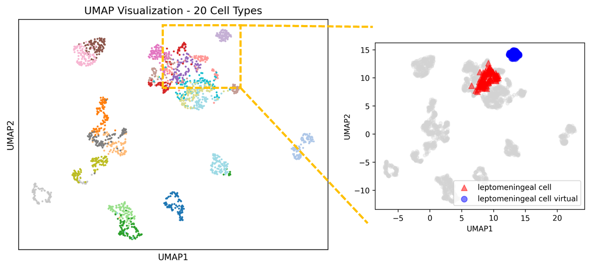

# CellLM: A generative pre-trained cell language model for Single-Cell RNA-Seq Analysis

This decoder-only architecture is trained through self-supervised learning on large-scale unannotated single-cell data, enabling it to capture intrinsic patterns of cellular states. As a universal cellular state generator, its core capabilities encompass multiple downstream tasks including cell type annotation, generation of virtual cells and perturbation prediction.

## Downstream Task
- Cell Type Annotation: leveraging pre-trained representations for accurate cell type identification.
- Virtual cell generation: generating virtual cells based on differentially expressed genes of certain cell type.

## Model Training
The decoder-only model was pretrained on 156,726 single cells * 33159 genes of the human embryonic meninges at 5-13 weeks post conception (download from CellxGene). The training scripts is wrapped up in 

## Performance Highlights
### Cell type annotation:
- given 1% or 5% training dataset, the pretrained model+MLP (transfer learning) is outperform over MLP in precision and recall.

### Virtual cell generation:
- given part of differentially expressed genes of leptomeningeal_cell, we obtain virtual cells with similar gene expression.

